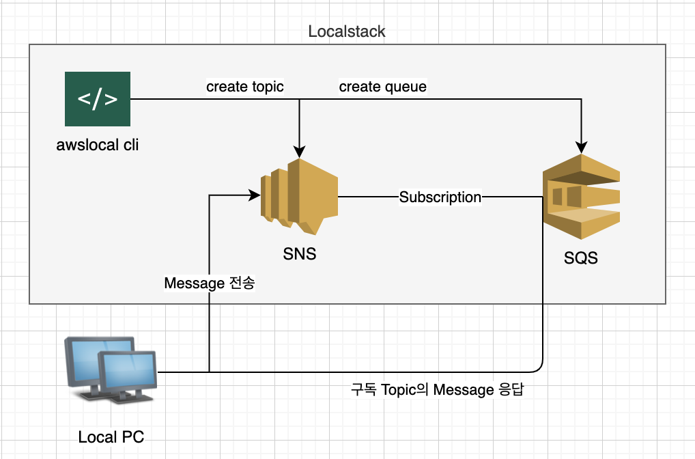

### AWS SNS-SQS With Localstack Example

#### Goals
* Localstack 사용법
* AWS SNS (Simple Notification Service)
* AWS SQS (Simple Queue Service)
* AWS SNS의 하나의 구독자로 SQS를 사용 가능    

#### Tech. Spec
* Spring Boot 2.2.5.RELEASE
* Localstack (https://github.com/localstack/localstack)
* AWS SQS (Simple Queue Service)
* AWS SNS (Simple Notification Service)
* JDK 11

#### Setup
* 로컬 PC에 Localstack 설치
* AWS SNS Topic 생성: awslocal --endpoint-url=http://localhost:4575 sns create-topic --name spring-cloud-test-topic
* AWS SQS Queue 생성: awslocal --endpoint-url=http://localhost:4576 sqs create-queue --queue-name spring-cloud-test-queue
* SNS-SQS 구독: awslocal --endpoint-url=http://localhost:4575 sns subscribe --topic-arn arn:aws:sns:us-east-1:000000000000:spring-cloud-test-topic --protocol sqs --notification-endpoint arn:aws:sqs:us-east-1:queue:spring-cloud-test-queue

#### 구성도

#### 테스트 방법
* sns topic publish: http://localhost:9090/sns-publish   
SNS Topic으로 메시지를 전송하면 이미 구독하고 있는 SQS Notification 동작   
* SQS 단독 publish: http://localhost:9090/sqs-publish?msg=sample   

